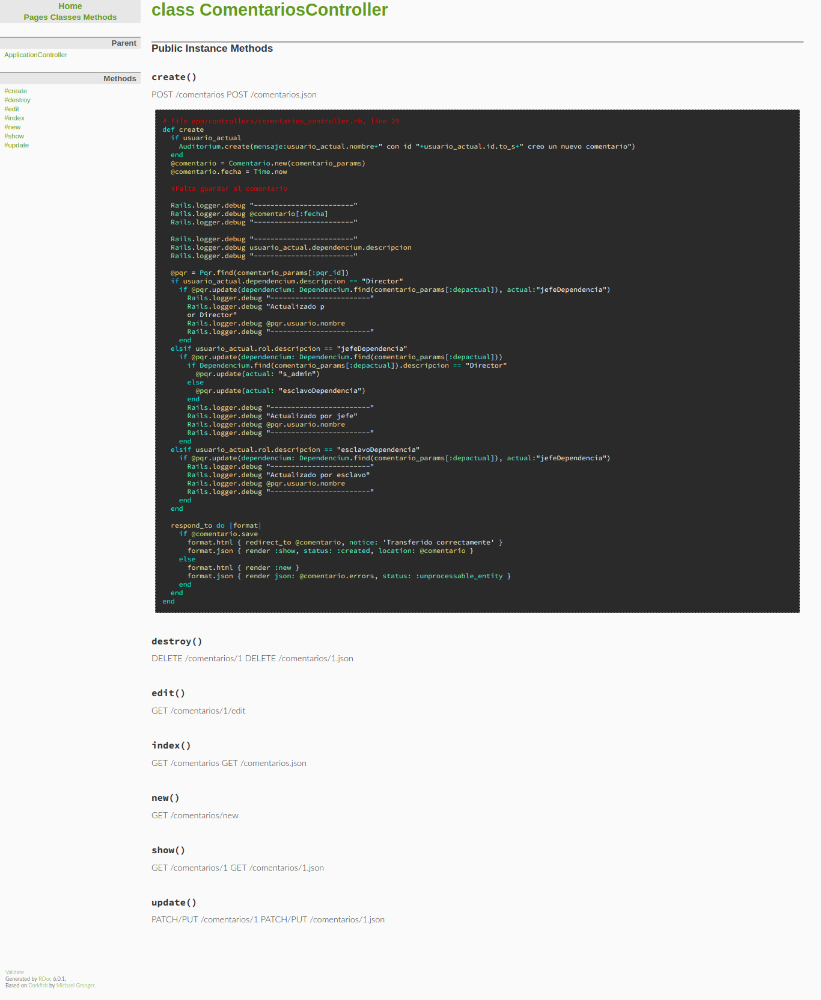

<p align="center"></p>

## Acerca del proyecto


Se tienen las siguientes migraciones

> CreateTipodocumentos

Crea la tabla para los tipos de documentos, atributos

- descripcion (string para el tipo de documento ej: *CC*)

> CreateRols

Crea la tabla para los roles, atributos

- descripcion (string para el rol ej: *s_admin*)

> CreateDependencia

Crea la tabla para las dependencias, atributos

- descripcion (string para la dependencia ej: *Director*)

> CreateUsuarios

Crea la tabla de usuarios, atributos

- nombre (string para el nombre del usuario ej: *Jose*)
- apellido (string para el apellido del usuario ej: *Altamar*)
- celular (string para el celular del usuario ej: *3002892012*)
- rol (llave foranea para indicar el rol del usuario)
- dependencium (llave fonarea para indicar la dependencia del usuario)
- tipodocumento (llave foranea para indicar el tipo de documento del usuario)
- passwork (string para que el usuario pueda iniciar sesión)

> CreatePqrs

Crea la tabla de Pqr's, atributos

- fecha (datetime para la fecha de creación del pqr)
- descripcion (string para la descripción del pqr)
- archivo (string para guardar la ruta abjunta al pqr)
- estado (booleano para saber si el pqr está respondido o no)
- usuario (llave foranea que dice el usuario dueño del pqr)
- dependencium (llave foranea que dice que dependencia tiene actualmente el pqr a su cargo)
- respuesta (string para cuando se le de respuesta al pqr)
- actual (string para saber si es director, esclavo, o jefe que tiene asignado el pqr)

> CreateNotifications

Crea la tabla para guardar las notificaciones, atributos

- mensaje (string para el mensaje de la notificación)
- idUsuario (string de el id del usuario al que se le enviará la notificación)
- leida (booleano para indicar si la notificación fue leída o no)
- pqr (string que indica el id del pqr por el cual se creó la notificación)

> CreateComentarios

Crea la tabla para guardar los comentarios al transferir el pqr, atributos

- fecha (datetime para guardar lafecha en que se transfirio)
- comentario (string para el comentario)
- depactual (string para saber a la nueva dependencia a la que se pasará el pqr)
- depanterior (string para saber de que dependencia viene el comentario)
- pqr (llave foranea para saber a que pqr pertenece el comentario)

> CreateAuditoria

Crear la tabla de auditorias

- mensaje (string para guardar la acción realizada)


#### Por otra parte se tiene

Que cada controlador tiene los respectivos metodos para crear, actualizar, eliminar y ver con la respectiva logíca necesaria para que funcionen como debe, para cada caso se puede ver el bloque de código en la carpeta /doc/ accedemos a index.html y buscamos por ejemplo *ComentariosController* y vemos sus respectivos metodos




Tambien tenemos el controlador de sesiones 

```ruby
class SessionsController < ApplicationController
  def new
  end

  def create
    u = Usuario.find_by_email(params[:email])
    if u && u.authenticate(params[:password])
      session[:usuario_id] = u.id
      redirect_to root_url, notice: "Logueado!"
    else
      flash.now[:alert] = "Correo o contraseña incorrecto@"
      render "new"
    end
  end

  def destroy
    session[:usuario_id] = nil
    redirect_to root_url, notice: "Desconectado!"
  end
end
```

Que crea una nueva sesión una vez iniciemos sesión o la destruye en caso de cerrar la sesión.

Y en application_controller.rb tenemos una función que crea la variable usuario_actual siempre y cuando exista una sesión

```ruby
class ApplicationController < ActionController::Base
    helper_method :usuario_actual

    def usuario_actual
        if session[:usuario_id]
            @usuario_actual ||= Usuario.find(session[:usuario_id])
        else
            @usuario_actual = nil
        end
    end
end
```

--- ---

Para modo de ayuda tenemos definido un seeder (en *seeds.rb*) que nos ayuda a crear roles, tipos de documentos, dependencias y algunos usuarios siempre que hagamos reset en las migraciones, lo corremos casí siempre así

```
$ rails db:migrate:reset db:seed
```

para este caso crea 8 usuarios (uno de cada rol y por cada dependencia), 1 tipo de documento, 4 roles  y 5 dependencias.

--- ---

Los diagramas de clase se pueden ver en la carpeta /diagramas/

--- ---

[Video de prueba de la aplicación](https://www.youtube.com/watch?v=j9HQ8C2DPyU) 

[Link de la aplicación en heroku](http://bit.ly/finalArqJp)

--- ---

